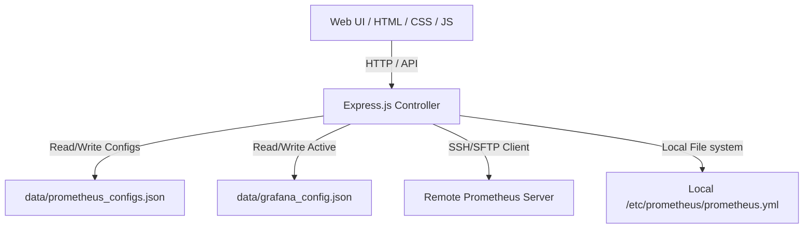

# Product Requirement Document (PRD)

## Project Name: Hephaestus DevOps Portal
**Module**: Unified Connections Management & Prometheus Configurator
**Status**: Implemented & Standardized

---

## 1. Executive Summary & Objective
Hephaestus is a lightweight DevOps control plane designed to manage monitoring integrations, query metrics, and configure Prometheus scrape targets from a single Web UI. 

Previously, Hephaestus supported only static, single-server configurations or Grafana-only endpoint settings. The objective of this release was to integrate a **Unified Connections Management System** supporting:
1. Multi-server environments.
2. Dynamic connection profile switching for both Grafana API endpoints and Prometheus servers.
3. SSH/SFTP capability to manage remote Prometheus instances, allowing editing of `prometheus.yml` files over secure tunnels.
4. An integrated exporter installer to generate service commands and YAML targets.

---

## 2. Target Users & Personas
*   **System Administrators / DevOps Engineers**: Need to spin up, configure, and maintain Prometheus scrape jobs across multiple remote VMs/nodes without manually editing SSH/YAML files on every individual host.
*   **Operations Personnel**: Need to verify connection health status of registered monitoring servers at a glance without terminal access.

---

## 3. Product Features & Scope

### 3.1. Unified Connections Management Dashboard
*   **Single-Pane Registration**: Registrations are managed from a single unified form in the UI.
*   **Branching Connection Types**:
    *   **Grafana Core API**: Requires Host URL, Bearer Service Account Token, and Datasource UID.
    *   **Prometheus Server**: Toggles between Local file access (same server) and SSH/SFTP access (remote node).
*   **Dynamic Status Verification (Ping Test)**:
    *   Asynchronous network probes test connectivity on load or manually via the "Ping Test" button on each registry card.
    *   Local files are tested for system path existence.
    *   Remote nodes test SSH handshake and SFTP access.
*   **Activation Routing**: Users can activate any connection profile. The active configuration updates backend services for report gathering, YAML editing, and dashboard metrics queries.

### 3.2. Prometheus YAML Configuration Editor
*   **Direct Web UI Editing**: Full text area in the browser to view and edit `prometheus.yml`.
*   **Pre-save Validation**: Integrates a validation check (`promtool` or dry-run parser) before saving to ensure the configuration is syntactically sound, preventing system crash on reload.
*   **Hot Reload Trigger**: Saves configuration and issues a reload trigger via the Prometheus `/-/reload` HTTP POST endpoint.
*   **Active Target Insertion**: Quickly insert snippet templates generated from the Exporter Installer page directly into `scrape_configs`.

### 3.3. Exporter Installer & Setup Generator
*   **Service Command Generation**: Automated guides for installing common exporters:
    *   `node_exporter` (Linux / Arm / Windows)
    *   `blackbox_exporter`
    *   `snmp_exporter`
*   **Platform Detection**: Supports target selection for Linux AMD64, Linux ARM, and Windows, fetching releases dynamically from official GitHub repositories.
*   **Systemd Integration**: Output ready-to-run bash commands to download, extract, configure, and register the exporter as a `systemd` daemon.

---

## 4. Technical Architecture & File System

### 4.1. Storage Layer
Connection registry data is persisted in JSON files within the `data/` directory:
*   `data/grafana_configs.json`: Saved profiles for Grafana servers.
*   `data/prometheus_configs.json`: Saved profiles for Prometheus servers.
*   `data/grafana_config.json`: The currently active Grafana configuration cache.

### 4.2. SSH Private Key & Credential Handling
*   Supports standard Password authentication and PEM-encoded Private Key authentication.
*   SFTP streams read and write config files on remote nodes on-demand.

---

## 5. API Endpoints Specification

### 5.1. Prometheus Connections Management
*   **GET `/api/v1/prometheus/configs`**: List all registered Prometheus profiles.
*   **POST `/api/v1/prometheus/configs`**: Create a new Prometheus profile.
*   **PUT `/api/v1/prometheus/configs/:id`**: Update an existing Prometheus profile.
*   **DELETE `/api/v1/prometheus/configs/:id`**: Delete a Prometheus profile.
*   **POST `/api/v1/prometheus/configs/:id/activate`**: Set a profile as the active configuration.
*   **POST `/api/v1/prometheus/configs/:id/test`**: Test connectivity of a profile by ID.

### 5.2. Active Prometheus Configuration Operations
*   **GET `/api/v1/prometheus/config`**: Reads `prometheus.yml` content from the active profile (local file or SSH/SFTP).
*   **POST `/api/v1/prometheus/config`**: Validates, writes new YAML contents, and triggers reload.
*   **POST `/api/v1/prometheus/config/validate`**: Performs syntax checks on arbitrary YAML configuration strings.

---

## 6. Non-Functional Requirements
*   **Aesthetics**: Sleek dark UI adhering to modern design principles, utilizing Outfit and Inter fonts, HSL color tokens, and custom SVG icons without generic emoji dependencies.
*   **Robust Error Handling**: Connection failures (e.g. SSH timeout, invalid YAML syntax) are reported back to the user with actionable notifications.
*   **No Code Placeholders**: Complete implementation of all frontend forms, validation states, and backend actions.
